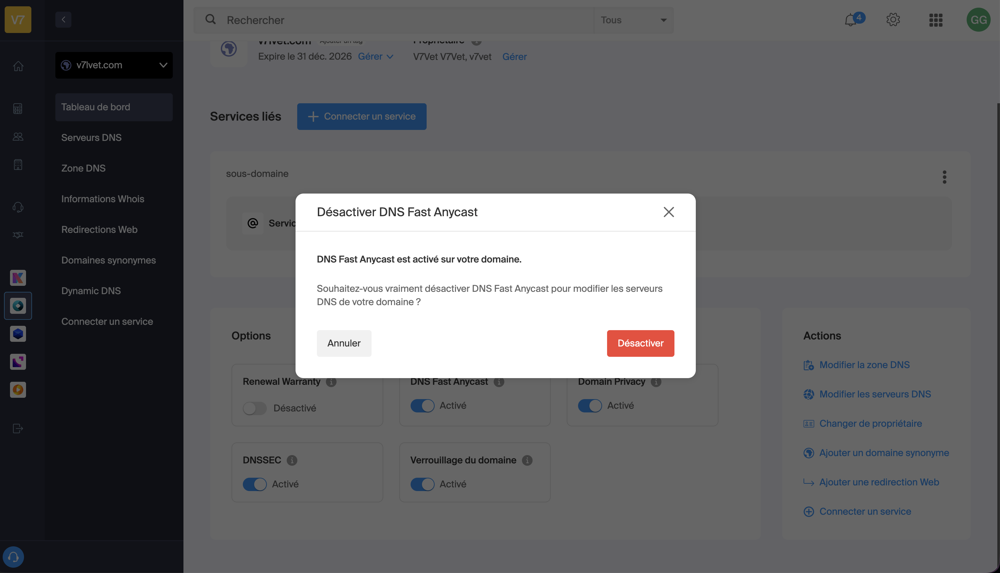

# FISCAL RULE ENGINE — SPÉCIFICATION TECHNIQUE COMPLÈTE

> **Prompt de développement** · Cabinet d'expertise comptable · v1.0  
> Stack : Next.js 14 App Router · Convex · Better Auth · TypeScript · Tailwind CSS

---

## TABLE DES MATIÈRES

1. [Rôle et contexte](#01--rôle-et-contexte)
2. [Architecture globale](#02--architecture-globale)
3. [Base de données Convex](#03--base-de-données-convex)
4. [Mutations et Queries Convex](#04--mutations-et-queries-convex)
5. [Moteur d'évaluation — Run Engine](#05--moteur-dévaluation--run-engine)
6. [Règles fiscales complètes](#06--règles-fiscales-complètes)
7. [Champs société et opérateurs](#07--champs-société-et-opérateurs)
8. [Interface Rule Editor — Front](#08--interface-rule-editor--front)
9. [Routes et pages Next.js](#09--routes-et-pages-nextjs)
10. [Instructions de développement](#10--instructions-de-développement)
11. [Variables d'environnement](#11--variables-denvironnement)
12. [Tests de validation](#12--tests-de-validation)

---

## 01 — Rôle et contexte

### Mission

Tu es un développeur full-stack senior spécialisé en SaaS B2B et en droit fiscal français. Tu dois construire de bout en bout une application web interne pour un cabinet d'expertise comptable. Cette application s'appelle le **Fiscal Rule Engine**.

**Objectif :** Construire un système configurable visuellement qui permet aux collaborateurs du cabinet de gérer les règles fiscales sans aucune intervention technique. Un éditeur d'arbres de décision remplace toute logique codée en dur.

### Problème à résoudre

Le cabinet gère plus de 200 règles conditionnelles qui déterminent quelles tâches fiscales (deadlines) créer pour chaque client selon son profil. Ces règles évoluent chaque année avec la législation. L'objectif est de les externaliser dans une base de données Convex, éditables via une interface visuelle de type arbre de décision.

### Stack technique imposée

| Couche | Technologie | Remarques |
|--------|-------------|-----------|
| **Front** | Next.js 14 App Router + TypeScript | PAS de Pages Router. Tout dans `/app`. |
| **Back** | Convex (serverless, temps réel, TypeScript natif) | PAS de Supabase. PAS de Firebase. PAS d'API REST custom. |
| **Auth** | Better Auth avec Convex adapter | PAS de NextAuth. PAS de Clerk. |
| **UI** | Tailwind CSS | Base-toi sur la brand Endosia définie dans le prompt système. Dark theme professionnel. |
| **Typo** | DM Sans + DM Mono | Importées via `next/font/google` |
| **Deploy** | Vercel (front) + Convex Cloud (back) | |

> **Design** : La charte graphique est définie dans le prompt système Endosia. Respecte-la strictement. Fond `#050810`, accent `#1D4ED8`, dark theme chirurgical, pas de gradients inutiles.

---

## 02 — Architecture globale

### Vue d'ensemble des 3 modules

| Module | Rôle | Accès |
|--------|------|-------|
| **Rule Editor** | Canvas drag & drop pour créer/modifier l'arbre de règles fiscales | Admin cabinet uniquement |
| **Run Engine** | Moteur d'évaluation : lit l'arbre, évalue le profil client, génère les tâches avec dates calculées | Déclenché via bouton par un collaborateur |
| **Simulator** | Bac à sable pour tester une combinaison de champs clients sans créer de vraies tâches | Admin + collaborateurs |

### Flux de données

```
Admin → Rule Editor → upsertNode() → fiscal_rule_nodes (Convex)
                                              ↓
Collaborateur → Lance un Run → runEngine() → évalue l'arbre contre le profil client
                                              ↓
                              run_tasks (Convex) — tâches avec dates calculées
```

1. L'admin crée/modifie des nœuds dans le Rule Editor → sauvegarde en temps réel dans Convex (`fiscal_rule_nodes`)
2. Quand un Run est lancé pour un client : le Run Engine charge l'arbre, évalue chaque nœud contre le profil de la société, génère les tâches avec dates calculées
3. Les tâches générées sont persistées dans `run_tasks` et consultables depuis l'interface
4. Le Simulator : même moteur d'évaluation, résultat affiché en mémoire seulement (rien n'est persisté)

### Structure fichiers Next.js

```
/app
  /layout.tsx                    # ConvexProvider + BetterAuth SessionProvider
  /page.tsx                      # Login page
  /dashboard/page.tsx
  /editor/page.tsx               # Rule Editor — route protégée admin
  /editor/versions/page.tsx
  /simulator/page.tsx
  /runs/page.tsx
  /runs/[runId]/page.tsx
  /clients/page.tsx
  /clients/[societeId]/page.tsx
  /api
    /auth/[...all]/route.ts      # Better Auth handler

/convex
  /schema.ts                     # Définition des 7 tables
  /fiscalRules.ts                # Queries + mutations nœuds
  /runEngine.ts                  # Action runEngine()
  /societes.ts                   # Queries sociétés
  /runs.ts                       # Queries + mutations runs
  /versions.ts                   # Gestion versions

/components
  /editor
    /Canvas.tsx
    /NodeCard.tsx
    /Edges.tsx
    /SidePanel.tsx
    /Minimap.tsx
  /simulator
    /SimulatorModal.tsx
  /ui

/lib
  /runEngine.ts                  # Logique d'évaluation (partagée front/back)
  /fiscalFields.ts               # Catalogue des 22 champs + opérateurs
```

---

## 03 — Base de données Convex

> **Important :** Toutes les tables sont définies dans `convex/schema.ts` avec `defineSchema()` et `defineTable()`. Les IDs sont des `Id<'table_name'>` Convex natifs. Ne jamais utiliser de UUID manuels.

### Table 1 : `fiscal_rule_nodes`

Table centrale. Chaque enregistrement est un nœud de l'arbre de décision. L'arbre entier est stocké sous forme de nœuds liés par `parent_id`, avec une position `x/y` pour le canvas.

```typescript
// convex/schema.ts
fiscal_rule_nodes: defineTable({
  cabinet_id:   v.id("cabinets"),
  node_type:    v.union(
                  v.literal("group"),
                  v.literal("condition"),
                  v.literal("task"),
                  v.literal("action")
                ),
  parent_id:    v.optional(v.id("fiscal_rule_nodes")),  // null = racine
  branch:       v.optional(v.union(v.literal("yes"), v.literal("no"))),
  position_x:   v.number(),
  position_y:   v.number(),
  domain:       v.optional(v.string()),  // IS | IR | TVA | CFE | CVAE | TAXES | TS | AUTRES
  order_index:  v.number(),

  // Présent uniquement si node_type = "condition"
  condition: v.optional(v.object({
    field:      v.string(),        // ID du champ société ex: "categorie_fiscale"
    operator:   v.string(),        // eq | neq | contains | in | gte | gt | lte | lt | between | is_true | is_false
    value:      v.optional(v.string()),
    value_min:  v.optional(v.string()),  // Pour "between" uniquement
    value_max:  v.optional(v.string()),  // Pour "between" uniquement
    logic:      v.optional(v.string()),  // AND | OR (réservé pour futures conditions multiples)
  })),

  // Présent uniquement si node_type = "task"
  task: v.optional(v.object({
    template_name:   v.string(),         // Nom du template de tâche ex: "CFE - Solde"
    domain:          v.string(),
    date_type:       v.string(),         // fixed | relative | fixed_if_3112 | relative_to_ago | relative_to_div | none
    fixed_day:       v.optional(v.number()),
    fixed_month:     v.optional(v.number()),
    fixed_year_ref:  v.optional(v.string()),  // "N-1" | "N" | "N+1"
    relative_months: v.optional(v.number()),  // Ex: 3.5 = 3 mois + 15 jours
    relative_base:   v.optional(v.string()),  // "cloture" | "ago" | "dividende"
  })),

  // Présent uniquement si node_type = "group"
  group_label:  v.optional(v.string()),

  // Présents uniquement si node_type = "action"
  action_label: v.optional(v.string()),
  action_note:  v.optional(v.string()),

  created_at:   v.number(),
  updated_at:   v.number(),
  updated_by:   v.id("users"),
})
  .index("by_cabinet",        ["cabinet_id"])
  .index("by_parent",         ["parent_id"])
  .index("by_cabinet_domain", ["cabinet_id", "domain"]),
```

> **Convention `.5` mois** : `3.5 mois = 3 mois + 15 jours`. Cette convention est issue du droit fiscal français et **doit** être respectée à l'identique dans tout le moteur d'évaluation. Voir `safeAddDate` en section 05.

---

### Table 2 : `cabinets`

```typescript
cabinets: defineTable({
  name:       v.string(),
  slug:       v.string(),  // Identifiant URL unique ex: "cabinet-martin"
  plan:       v.string(),  // "starter" | "pro" | "enterprise"
  created_at: v.number(),
})
  .index("by_slug", ["slug"]),
```

---

### Table 3 : `users`

```typescript
users: defineTable({
  cabinet_id:      v.id("cabinets"),
  email:           v.string(),
  name:            v.string(),
  role:            v.string(),  // "admin" | "collaborator" | "viewer"
  better_auth_id:  v.string(),
  created_at:      v.number(),
})
  .index("by_cabinet",        ["cabinet_id"])
  .index("by_better_auth_id", ["better_auth_id"]),
```

---

### Table 4 : `societes`

Représente un client du cabinet. Contient son profil fiscal complet. C'est la source de données pour le Run Engine.

```typescript
societes: defineTable({
  cabinet_id: v.id("cabinets"),
  name:       v.string(),  // Raison sociale

  // ── Identité juridique & fiscale ──
  forme_juridique:   v.optional(v.string()),
  // Valeurs : "EI" | "Micro-entreprise" | "EURL" | "SARL" | "SAS" | "SASU"
  //         | "SA" | "SNC" | "SCI" | "SCM" | "SCP" | "Association"

  categorie_fiscale: v.optional(v.string()),
  // Valeurs : "IR" | "IR - BNC" | "IR - BIC" | "IR - RF" | "IS"

  regime_fiscal:     v.optional(v.string()),
  // Valeurs : "Micro" | "Réel" | "Réel simplifié" | "Réel normal"
  //         | "Réel complet" | "Micro simplifié" | "Micro complet"

  activite:          v.optional(v.string()),
  // Valeurs : "Profession libérale médicale conventionnée"
  //         | "Autres professions libérales"
  //         | "Activité commerciale, industrielle, artisanale"

  secteur:           v.optional(v.string()),
  // Valeurs : "Commerce & Distribution" | "Services" | "Industrie" | "BTP"

  // ── Clôture comptable ──
  date_cloture: v.optional(v.string()),
  // Format "DD/MM" ex: "31/12" ou "30/06"
  // L'année est celle du Run (annee_run_a_creer)

  // ── TVA ──
  regime_tva:    v.optional(v.string()),
  // Valeurs : "Exonérée de TVA" | "Franchise en base de TVA"
  //         | "Réel normal" | "Régime réel simplifié (RSI)"

  frequence_tva: v.optional(v.string()),
  // Valeurs : "Mensuelle" | "Trimestrielle" | "Annuelle"

  jour_tva:      v.optional(v.number()),
  // Décalage en jours après la fin de mois/trimestre ex: 19

  // ── Financier ──
  ca_n1:          v.optional(v.number()),  // Seuils clés : 152 500 et 500 000
  montant_cfe_n1: v.optional(v.number()),  // Seuil clé : 3 000
  montant_cvae_n1:v.optional(v.number()),  // Seuil clé : 1 500
  montant_ts_n1:  v.optional(v.number()),  // Seuils clés : 4 000 et 10 000

  // ── Immobilier ──
  local_pro:           v.optional(v.boolean()),
  proprietaire:        v.optional(v.boolean()),
  surface_commerciale: v.optional(v.number()),  // m² — seuil clé : 400
  departement:         v.optional(v.string()),
  // String car "06" ne peut pas être un number — ex: "75", "06", "13"

  // ── Employés ──
  nombre_employes: v.optional(v.number()),  // Seuil clé : 1

  // ── Options fiscales ──
  paiement_is_unique: v.optional(v.boolean()),
  // true = solde seul | false = 4 acomptes IS
  tve:          v.optional(v.boolean()),
  taxe_fonciere:v.optional(v.boolean()),

  // ── Dates spéciales ──
  date_paiement_dividende: v.optional(v.string()),  // ISO YYYY-MM-DD
  annee_run_a_creer:       v.optional(v.number()),  // Ex: 2024

  updated_at: v.number(),
})
  .index("by_cabinet", ["cabinet_id"]),
```

---

### Table 5 : `runs`

Un Run est une instance d'exécution des règles pour une société sur un exercice donné.

```typescript
runs: defineTable({
  cabinet_id:    v.id("cabinets"),
  societe_id:    v.id("societes"),
  exercice_year: v.number(),
  status:        v.string(),           // "pending" | "running" | "completed" | "error"
  tree_snapshot: v.optional(v.string()),
  // JSON.stringify() de l'arbre au moment du Run — audit trail immuable
  tasks_count:   v.optional(v.number()),
  error_message: v.optional(v.string()),
  created_at:    v.number(),
  completed_at:  v.optional(v.number()),
  created_by:    v.id("users"),
})
  .index("by_cabinet", ["cabinet_id"])
  .index("by_societe",  ["societe_id"]),
```

---

### Table 6 : `run_tasks`

Chaque tâche générée par un Run.

```typescript
run_tasks: defineTable({
  run_id:                  v.id("runs"),
  cabinet_id:              v.id("cabinets"),  // Dénormalisé pour queries rapides
  societe_id:              v.id("societes"),
  template_name:           v.string(),         // Ex: "CFE - Solde"
  domain:                  v.string(),         // IS | IR | TVA | CFE | CVAE | TAXES | TS | AUTRES
  due_date:                v.optional(v.string()),  // ISO YYYY-MM-DD — null si date_type = "none"
  date_type_used:          v.string(),         // Pour audit ex: "fixed_if_3112"
  date_calculation_detail: v.optional(v.string()),
  // Lisible ex: "15/05/N+1 car clôture au 31/12"
  status:                  v.string(),         // "pending" | "done" | "error"
  source_node_id:          v.optional(v.id("fiscal_rule_nodes")),
  created_at:              v.number(),
})
  .index("by_run",     ["run_id"])
  .index("by_cabinet", ["cabinet_id"])
  .index("by_societe", ["societe_id"]),
```

---

### Table 7 : `rule_versions`

Historique immutable des versions de l'arbre.

```typescript
rule_versions: defineTable({
  cabinet_id:     v.id("cabinets"),
  version:        v.number(),           // Numéro séquentiel auto-incrémenté
  label:          v.optional(v.string()),
  // Ex: "Mise à jour loi de finances 2025"
  nodes_snapshot: v.string(),           // JSON.stringify() de tous les nœuds
  nodes_count:    v.number(),
  created_at:     v.number(),
  created_by:     v.id("users"),
})
  .index("by_cabinet", ["cabinet_id"]),
```

---

## 04 — Mutations et Queries Convex

### Queries

#### `getTree(cabinet_id)`

Charge tous les nœuds d'un cabinet. Retourne le tableau plat — le front reconstruit l'arbre visuellement via `parent_id`.

```typescript
// convex/fiscalRules.ts
export const getTree = query({
  args: { cabinet_id: v.id("cabinets") },
  handler: async (ctx, { cabinet_id }) => {
    return await ctx.db
      .query("fiscal_rule_nodes")
      .withIndex("by_cabinet", q => q.eq("cabinet_id", cabinet_id))
      .order("asc")
      .collect();
  }
});
```

#### `getSocieteProfile(societe_id)`

Charge le profil complet d'une société pour le Run Engine.

#### `getRun(run_id)`

Charge un Run avec ses `run_tasks` associées.

---

### Mutations

#### `upsertNode(node)`

Crée ou met à jour un nœud. Met à jour `updated_at` automatiquement.

```typescript
export const upsertNode = mutation({
  args: {
    id:           v.optional(v.id("fiscal_rule_nodes")),  // Absent = création
    cabinet_id:   v.id("cabinets"),
    node_type:    v.string(),
    parent_id:    v.optional(v.id("fiscal_rule_nodes")),
    branch:       v.optional(v.string()),
    position_x:   v.number(),
    position_y:   v.number(),
    domain:       v.optional(v.string()),
    condition:    v.optional(v.any()),
    task:         v.optional(v.any()),
    group_label:  v.optional(v.string()),
    action_label: v.optional(v.string()),
    action_note:  v.optional(v.string()),
    order_index:  v.optional(v.number()),
  },
  handler: async (ctx, args) => {
    const now = Date.now();
    const user = await getCurrentUser(ctx);
    if (args.id) {
      await ctx.db.patch(args.id, { ...args, updated_at: now, updated_by: user._id });
      return args.id;
    } else {
      return await ctx.db.insert("fiscal_rule_nodes", {
        ...args,
        created_at:  now,
        updated_at:  now,
        updated_by:  user._id,
        order_index: args.order_index ?? 0,
      });
    }
  }
});
```

#### `deleteNodeCascade(node_id)`

Supprime un nœud ET tous ses descendants récursivement via BFS.

```typescript
export const deleteNodeCascade = mutation({
  args: { node_id: v.id("fiscal_rule_nodes") },
  handler: async (ctx, { node_id }) => {
    const toDelete: Id<"fiscal_rule_nodes">[] = [node_id];
    let i = 0;
    while (i < toDelete.length) {
      const children = await ctx.db
        .query("fiscal_rule_nodes")
        .withIndex("by_parent", q => q.eq("parent_id", toDelete[i]))
        .collect();
      toDelete.push(...children.map(c => c._id));
      i++;
    }
    await Promise.all(toDelete.map(id => ctx.db.delete(id)));
    return toDelete.length;
  }
});
```

#### `saveVersion(cabinet_id, label?)`

Crée un snapshot immutable de l'arbre courant avec auto-incrément de version.

```typescript
export const saveVersion = mutation({
  args: { cabinet_id: v.id("cabinets"), label: v.optional(v.string()) },
  handler: async (ctx, { cabinet_id, label }) => {
    const nodes = await ctx.db
      .query("fiscal_rule_nodes")
      .withIndex("by_cabinet", q => q.eq("cabinet_id", cabinet_id))
      .collect();
    const last = await ctx.db
      .query("rule_versions")
      .withIndex("by_cabinet", q => q.eq("cabinet_id", cabinet_id))
      .order("desc")
      .first();
    const version = (last?.version ?? 0) + 1;
    return await ctx.db.insert("rule_versions", {
      cabinet_id,
      version,
      label,
      nodes_snapshot: JSON.stringify(nodes),
      nodes_count:    nodes.length,
      created_at:     Date.now(),
      created_by:     (await getCurrentUser(ctx))._id,
    });
  }
});
```

---

## 05 — Moteur d'évaluation (Run Engine)

> **CRITIQUE** : Toute erreur de calcul de date = deadline manquée pour un client du cabinet.

### Interface du profil société

```typescript
// lib/runEngine.ts
interface SocieteProfile {
  forme_juridique?:         string;
  categorie_fiscale?:       string;
  regime_fiscal?:           string;
  activite?:                string;
  secteur?:                 string;
  date_cloture?:            string;   // Format "DD/MM"
  regime_tva?:              string;
  frequence_tva?:           string;
  jour_tva?:                number;
  ca_n1?:                   number;
  montant_cfe_n1?:          number;
  montant_cvae_n1?:         number;
  montant_ts_n1?:           number;
  local_pro?:               boolean;
  proprietaire?:            boolean;
  surface_commerciale?:     number;
  departement?:             string;
  nombre_employes?:         number;
  paiement_is_unique?:      boolean;
  tve?:                     boolean;
  taxe_fonciere?:           boolean;
  date_paiement_dividende?: string;
  annee_run_a_creer?:       number;
}
```

### Contexte d'exécution

```typescript
interface RunContext {
  anneeN:         number;        // Année de l'exercice ex: 2024
  dateCloture:    Date;          // Construite depuis date_cloture + anneeN
  isCloture3112:  boolean;       // true si clôture = 31 décembre
  dateAGO:        string | null; // Calculée quand le nœud AGO est traité — YYYY-MM-DD
  tasksGenerated: string[];      // Noms des tâches déjà créées
}
```

### Algorithme DFS

```typescript
function walkNode(
  nodeId: Id<"fiscal_rule_nodes">,
  nodes:  FiscalRuleNode[],
  profile: SocieteProfile,
  ctx:    RunContext
): GeneratedTask[] {
  const node = nodes.find(n => n._id === nodeId);
  if (!node) return [];
  const tasks: GeneratedTask[] = [];

  if (node.node_type === "group") {
    // Tous les enfants directs passent — pas de condition
    const children = nodes.filter(n => n.parent_id === nodeId);
    for (const child of children) {
      tasks.push(...walkNode(child._id, nodes, profile, ctx));
    }
  }

  else if (node.node_type === "condition") {
    const ok     = evalCondition(node.condition!, profile);
    const branch = ok ? "yes" : "no";
    const children = nodes.filter(n => n.parent_id === nodeId && n.branch === branch);
    for (const child of children) {
      tasks.push(...walkNode(child._id, nodes, profile, ctx));
    }
  }

  else if (node.node_type === "task" && node.task?.template_name) {
    const dueDate = calculateDueDate(node.task, profile, ctx);

    // L'AGO alimente ctx.dateAGO pour les nœuds dépendants
    if (node.task.template_name === "Approbation des comptes (AGO)") {
      ctx.dateAGO = dueDate;
    }

    tasks.push({
      template_name:           node.task.template_name,
      domain:                  node.task.domain,
      due_date:                dueDate,
      date_type_used:          node.task.date_type,
      date_calculation_detail: buildDateDetail(node.task, dueDate, ctx),
      source_node_id:          nodeId,
    });
    ctx.tasksGenerated.push(node.task.template_name);
  }

  // node_type === "action" → ne génère rien, ne bloque pas l'exécution

  return tasks;
}
```

### Évaluation des conditions

```typescript
function evalCondition(cond: ConditionObject, profile: SocieteProfile): boolean {
  const raw     = profile[cond.field as keyof SocieteProfile];
  const str     = typeof raw === "string" ? raw : String(raw ?? "");
  const num     = parseFloat(String(raw ?? "0"));
  const testNum = parseFloat(cond.value ?? "0");

  switch (cond.operator) {
    case "eq":       return str === cond.value;
    case "neq":      return str !== cond.value;
    case "contains": return str.includes(cond.value ?? "");
    case "in":       return (cond.value ?? "").split(",").map(s => s.trim()).includes(str);
    case "gte":      return num >= testNum;
    case "gt":       return num >  testNum;
    case "lte":      return num <= testNum;
    case "lt":       return num <  testNum;
    case "between":  return num >= parseFloat(cond.value_min ?? "0")
                         && num <= parseFloat(cond.value_max ?? "0");
    case "is_true":  return raw === true  || str === "true";
    case "is_false": return raw === false || str === "false";
    default:         return false;
  }
}
```

### Calcul des dates

```typescript
function calculateDueDate(
  task:    TaskObject,
  profile: SocieteProfile,
  ctx:     RunContext
): string | null {
  const { anneeN, dateCloture, isCloture3112, dateAGO } = ctx;

  switch (task.date_type) {

    case "fixed":
      return formatDate(
        task.fixed_day!,
        task.fixed_month!,
        resolveYear(anneeN, task.fixed_year_ref)
      );

    case "relative":
      return safeAddDate(dateCloture, task.relative_months!);

    case "fixed_if_3112":
      // SI clôture = 31/12 → date fixe (ex: 15/05/N+1)
      // SINON → date relative (ex: +3.5 mois après clôture)
      return isCloture3112
        ? formatDate(task.fixed_day!, task.fixed_month!, resolveYear(anneeN, task.fixed_year_ref))
        : safeAddDate(dateCloture, task.relative_months!);

    case "relative_to_ago":
      // Le nœud AGO doit impérativement être évalué avant ce nœud dans l'arbre
      if (!dateAGO) return null;
      return safeAddDate(new Date(dateAGO), task.relative_months!);

    case "relative_to_div":
      if (!profile.date_paiement_dividende) return null;
      const divDate = new Date(profile.date_paiement_dividende);
      divDate.setMonth(divDate.getMonth() + 1);
      return formatDate(15, divDate.getMonth() + 1, divDate.getFullYear());

    case "none":
      return null;  // Tâche sans date — saisie manuelle par le cabinet

    default:
      return null;
  }
}
```

```typescript
// ⚠️ Convention .5 mois — NE PAS MODIFIER
// 3.5 mois = 3 mois + 15 jours (règle fiscale française)
function safeAddDate(base: Date, months: number): string {
  const d = new Date(base);
  d.setMonth(d.getMonth() + Math.floor(months));
  if (months % 1 !== 0) d.setDate(d.getDate() + 15);
  return d.toISOString().split("T")[0];
}

function formatDate(day: number, month: number, year: number): string {
  return new Date(year, month - 1, day).toISOString().split("T")[0];
}

function resolveYear(anneeN: number, ref?: string): number {
  if (ref === "N-1") return anneeN - 1;
  if (ref === "N+1") return anneeN + 1;
  return anneeN;
}
```

### Règle spéciale : acomptes IS

Les 4 acomptes IS ont des dates qui dépendent de la période de clôture :

| Période de clôture | Acompte 1 | Acompte 2 | Acompte 3 | Acompte 4 |
|---|---|---|---|---|
| 20 fév – 19 mai N | 15/06/N-1 | 15/09/N-1 | 15/12/N-1 | 15/03/N |
| 20 mai – 19 août N | 15/09/N-1 | 15/12/N-1 | 15/03/N | 15/06/N |
| 20 août – 19 nov N | 15/12/N-1 | 15/03/N | 15/06/N | 15/09/N |
| 20 nov N – 19 fév N+1 (dont 31/12) | 15/03/N | 15/06/N | 15/09/N | 15/12/N |

```typescript
function getAcomptesIS(dateCloture: Date, anneeN: number) {
  const m = dateCloture.getMonth() + 1;
  const d = dateCloture.getDate();

  if ((m === 2 && d >= 20) || (m > 2 && m < 5) || (m === 5 && d <= 19)) {
    return {
      acc1: formatDate(15, 6,  anneeN - 1),
      acc2: formatDate(15, 9,  anneeN - 1),
      acc3: formatDate(15, 12, anneeN - 1),
      acc4: formatDate(15, 3,  anneeN),
    };
  } else if ((m === 5 && d >= 20) || (m > 5 && m < 8) || (m === 8 && d <= 19)) {
    return {
      acc1: formatDate(15, 9,  anneeN - 1),
      acc2: formatDate(15, 12, anneeN - 1),
      acc3: formatDate(15, 3,  anneeN),
      acc4: formatDate(15, 6,  anneeN),
    };
  } else if ((m === 8 && d >= 20) || (m > 8 && m < 11) || (m === 11 && d <= 19)) {
    return {
      acc1: formatDate(15, 12, anneeN - 1),
      acc2: formatDate(15, 3,  anneeN),
      acc3: formatDate(15, 6,  anneeN),
      acc4: formatDate(15, 9,  anneeN),
    };
  } else {
    // 20 nov – 19 fév N+1 (dont 31/12)
    return {
      acc1: formatDate(15, 3,  anneeN),
      acc2: formatDate(15, 6,  anneeN),
      acc3: formatDate(15, 9,  anneeN),
      acc4: formatDate(15, 12, anneeN),
    };
  }
}
```

> **Dépendance critique** : Dans l'arbre IS, le nœud "Approbation des comptes (AGO)" **doit être évalué avant** les nœuds "Dépôt des comptes au greffe" (+2m), "Etablissement des comptes annuels" (+2m) et "Cerfa 2777" (+15j). L'ordre des nœuds dans le seed doit respecter cela.

---

## 06 — Règles fiscales complètes

> Ces règles doivent être pré-chargées en base via un script `convex/seed.ts` qui crée tous les nœuds de l'arbre initial. L'arbre doit être opérationnel dès le premier déploiement.

### GROUPE IR — Impôt sur le Revenu

| Condition | Tâche générée | Date d'échéance |
|---|---|---|
| `categorie_fiscale` contient `"IR"` | IR - Déclaration | Si 31/12 : clôture +4.5m · Sinon : 15/05/N+1 |
| `categorie_fiscale` = `"IR - BNC"` ET `regime_fiscal` = `"Réel"` | Déclaration de résultat 2035 + annexes 2035 A et B | Si 31/12 : clôture +4.5m · Sinon : 15/05/N+1 |
| `categorie_fiscale` = `"IR - BIC"` ET `regime_fiscal` = `"Réel normal"` | IR - Déclaration de résultat : liasse fiscale complète | Si 31/12 : clôture +4.5m · Sinon : 15/05/N+1 |
| `categorie_fiscale` = `"IR - BIC"` ET `regime_fiscal` = `"Réel simplifié"` | IR - Déclaration de résultat : liasse fiscale simplifiée | Si 31/12 : clôture +4.5m · Sinon : 15/05/N+1 |
| `categorie_fiscale` = `"IR - RF"` ET `regime_fiscal` ∈ `{Réel simplifié, Micro simplifié}` | Déclaration de résultat : liasse fiscale simplifiée (2072-S) | Si 31/12 : clôture +4.5m · Sinon : 15/05/N+1 |
| `categorie_fiscale` = `"IR - RF"` ET `regime_fiscal` ∈ `{Réel complet, Micro complet}` | Déclaration de résultat : liasse fiscale complète (2072-C) | Si 31/12 : clôture +4.5m · Sinon : 15/05/N+1 |
| `activite` ∈ `{Profession libérale médicale conventionnée, Autres professions libérales, Activité commerciale...}` | Déclaration DSFU (+PAMC) | **Aucune date** — saisie manuelle |

---

### GROUPE IS — Impôt sur les Sociétés

| Condition | Tâche générée | Date d'échéance |
|---|---|---|
| `categorie_fiscale` = `"IS"` ET `regime_fiscal` = `"Réel simplifié"` | IS - Déclaration de résultat : liasse fiscale simplifiée | Si 31/12 : 15/05/N+1 · Sinon : clôture +3.5m |
| `categorie_fiscale` = `"IS"` ET `regime_fiscal` = `"Réel normal"` | IS - Déclaration de résultat : liasse fiscale complète | Si 31/12 : 15/05/N+1 · Sinon : clôture +3.5m |
| `categorie_fiscale` = `"IS"` | Déclaration solde IS - Cerfa 2572 | Si 31/12 : 15/05/N+1 · Sinon : clôture +4.5m |
| `categorie_fiscale` = `"IS"` | **Approbation des comptes (AGO)** → stocke `ctx.dateAGO` | Clôture +6 mois |
| `categorie_fiscale` = `"IS"` | Dépôt des comptes au greffe | `ctx.dateAGO` +2 mois |
| `categorie_fiscale` = `"IS"` | Etablissement des comptes annuels | `ctx.dateAGO` +2 mois |
| `categorie_fiscale` = `"IS"` | Entretien de présentation des comptes annuels | `ctx.dateAGO` +2 mois |
| `categorie_fiscale` = `"IS"` | Déclaration revenus capitaux mobiliers - Cerfa 2777 | `ctx.dateAGO` +15 jours |
| `categorie_fiscale` = `"IS"` | Déclaration revenus de capitaux mobiliers - Cerfa IFU 2561 | 15/02/N+1 (fixe) |
| `categorie_fiscale` = `"IS"` | IS - Solde | Si 31/12 : 15/05/N+1 · Sinon : clôture +3.5m |
| `categorie_fiscale` = `"IS"` ET `paiement_is_unique` = `false` | IS - Acompte_1, Acompte_2, Acompte_3, Acompte_4 | Table des 4 périodes par mois de clôture |

---

### GROUPE TVA

| Condition | Tâche(s) générée(s) | Date d'échéance |
|---|---|---|
| `regime_tva` ∈ `{Exonérée de TVA, Franchise en base de TVA}` | **AUCUNE tâche TVA** | — |
| `regime_tva` = `"Réel normal"` ET `frequence_tva` = `"Trimestrielle"` | TVA réel normal - déclaration T1 à T4 | Fin du trimestre + `jour_tva` jours |
| `regime_tva` = `"Réel normal"` ET `frequence_tva` = `"Mensuelle"` | TVA réel normal - déclaration [mois] × 12 | Fin du mois + `jour_tva` jours |
| `regime_tva` = `"Régime réel simplifié (RSI)"` | TVA réel simplifié - déclaration annuelle | Clôture +3 mois |
| `regime_tva` = `"Régime réel simplifié (RSI)"` | TVA réel simplifié - Acompte_1 | 31/07/N |
| `regime_tva` = `"Régime réel simplifié (RSI)"` | TVA réel simplifié - Acompte_2 | 31/12/N |

---

### GROUPE CFE / DECLOYER

| Condition | Tâche générée | Date d'échéance |
|---|---|---|
| Toujours | CFE - Solde | 15/12/N |
| `montant_cfe_n1` ≥ 3 000 | CFE - Acompte | 15/06/N |
| `montant_cfe_n1` < 3 000 | **RIEN** (nœud action "Rien à faire") | — |
| Toujours | CFE - Modification déclaration (1447-M) | 30/04/N+1 |
| `local_pro` = `true` | DECLOYER | Si 31/12 : 15/05/N+1 · Sinon : 15 du 3e mois après clôture |
| `local_pro` = `false` | **RIEN** (nœud action) | — |

---

### GROUPE CVAE

| Condition | Tâche générée | Date d'échéance |
|---|---|---|
| `ca_n1` < 152 500 | **RIEN** (nœud action) | — |
| `ca_n1` > 152 500 | Déclaration de valeur ajoutée (1330) + CVAE | 15/05/N+1 |
| `ca_n1` > 500 000 | CVAE - Formulaire 1329 - AC - SD - Solde | 01/05/N+1 |
| `ca_n1` > 500 000 ET `montant_cvae_n1` > 1 500 | CVAE - Formulaire 1329 - AC - SD - Acompte_1 | 15/06/N |
| `ca_n1` > 500 000 ET `montant_cvae_n1` > 1 500 | CVAE - Formulaire 1329 - AC - SD - Acompte_2 | 15/09/N |

---

### GROUPE TAXES DIVERSES

| Condition | Tâche générée | Date d'échéance |
|---|---|---|
| `regime_tva` ∈ `{Franchise, Exonérée, Réel normal}` | TVE - Formulaire 3310-A-SD | 31/01/N+1 |
| `regime_tva` = `"RSI"` ET clôture 31/12 | TVE - Formulaire 3517 | 01/05/N+1 |
| `regime_tva` = `"RSI"` ET clôture ≠ 31/12 | TVE - Formulaire 3517 | Clôture +3 mois |
| `categorie_fiscale` = `"IS"` ET clôture 31/12 | DAS2 - Formulaire 2460-2-SD | 01/05/N+1 |
| `categorie_fiscale` = `"IR"` ou clôture ≠ 31/12 | DAS2 - Formulaire 2460-2-SD | Clôture +3 mois |
| `proprietaire` = `true` | Taxe foncière | 30/09/N |
| `secteur` = `"Commerce & Distribution"` ET `surface_commerciale` ≥ 400 | TASCOM - Formulaire 3350-SD | 15/06/N |
| `departement` ∈ `{75,77,78,91,92,93,94,95,06,13,83}` | Taxe sur les bureaux - formulaire 6705-B | 01/03/N |

---

### GROUPE TAXE SUR LES SALAIRES (TS)

**Condition d'entrée :** `nombre_employes` ≥ 1 **ET** `regime_tva` ∈ `{Exonérée de TVA, Franchise en base de TVA}`

| Sous-condition | Tâche(s) générée(s) | Date d'échéance |
|---|---|---|
| `montant_ts_n1` ≤ 4 000 | TS - Formulaire 2502 (annuel) | 15/01/N+1 |
| `montant_ts_n1` > 4 000 ET ≤ 10 000 | TS - Formulaire 2501-SD-1 | 15/04/N |
| `montant_ts_n1` > 4 000 ET ≤ 10 000 | TS - Formulaire 2501-SD-2 | 15/07/N |
| `montant_ts_n1` > 4 000 ET ≤ 10 000 | TS - Formulaire 2501-SD-3 | 15/10/N |
| `montant_ts_n1` > 4 000 ET ≤ 10 000 | TS - Régularisation - 2502-SD | 31/01/N+1 |
| `montant_ts_n1` > 10 000 | TS - Formulaire 3310-A-SD - [mois] × 11 (jan à nov) | 15 du mois suivant |
| `montant_ts_n1` > 10 000 | TS - Régularisation - 2502-SD | 31/01/N+1 |

---

## 07 — Champs société et opérateurs

### Catalogue complet des 22 champs

| ID champ | Label FR | Type | Valeurs / Format |
|---|---|---|---|
| `forme_juridique` | Forme juridique | select | `EI` `Micro-entreprise` `EURL` `SARL` `SAS` `SASU` `SA` `SNC` `SCI` `SCM` `SCP` `Association` |
| `categorie_fiscale` | Catégorie fiscale | select | `IR` `IR - BNC` `IR - BIC` `IR - RF` `IS` |
| `regime_fiscal` | Régime fiscal | select | `Micro` `Réel` `Réel simplifié` `Réel normal` `Réel complet` `Micro simplifié` `Micro complet` |
| `activite` | Activité | select | `Profession libérale médicale conventionnée` `Autres professions libérales` `Activité commerciale, industrielle, artisanale` |
| `secteur` | Secteur | select | `Commerce & Distribution` `Services` `Industrie` `BTP` |
| `mois_cloture` | Mois de clôture | select | `Janvier` … `Décembre` |
| `regime_tva` | Régime TVA | select | `Exonérée de TVA` `Franchise en base de TVA` `Réel normal` `Régime réel simplifié (RSI)` |
| `frequence_tva` | Fréquence TVA | select | `Mensuelle` `Trimestrielle` `Annuelle` |
| `cloture_3112` | Clôture au 31/12 | boolean | `true` / `false` |
| `paiement_is_unique` | Paiement IS unique | boolean | `true` = solde seul · `false` = 4 acomptes |
| `local_pro` | Local professionnel | boolean | `true` / `false` |
| `proprietaire` | Propriétaire des locaux | boolean | `true` / `false` |
| `tve` | TVE applicable | boolean | `true` / `false` |
| `taxe_fonciere` | Taxe foncière applicable | boolean | `true` / `false` |
| `ca_n1` | CA N-1 (€) | number | Seuils clés : 152 500 · 500 000 |
| `montant_cfe_n1` | Montant CFE N-1 (€) | number | Seuil clé : 3 000 |
| `montant_cvae_n1` | Montant CVAE N-1 (€) | number | Seuil clé : 1 500 |
| `montant_ts_n1` | Montant TS N-1 (€) | number | Seuils clés : 4 000 · 10 000 |
| `surface_commerciale` | Surface commerciale (m²) | number | Seuil clé : 400 |
| `nombre_employes` | Nombre d'employés | number | Seuil clé : 1 |
| `departement` | Département | string | `75` `77` `78` `91` `92` `93` `94` `95` `06` `13` `83` — string car `"06"` ≠ nombre |
| `jour_tva` | Décalage Jour TVA | number | Jours à ajouter après fin de mois/trimestre · ex: `19` |

### Opérateurs disponibles par type

| Type | Opérateur | Code | Exemple |
|---|---|---|---|
| select | est égal à | `eq` | `categorie_fiscale = "IS"` |
| select | est différent de | `neq` | `regime_tva ≠ "Exonérée de TVA"` |
| select | contient | `contains` | `categorie_fiscale contains "IR"` |
| select | est l'un de | `in` | `forme_juridique ∈ {SARL, SAS, SASU}` |
| number | ≥ supérieur ou égal | `gte` | `ca_n1 ≥ 152500` |
| number | > strictement supérieur | `gt` | `ca_n1 > 500000` |
| number | ≤ inférieur ou égal | `lte` | `montant_ts_n1 ≤ 4000` |
| number | < strictement inférieur | `lt` | `montant_ts_n1 < 10000` |
| number | = égal à | `eq` | valeur exacte |
| number | entre deux valeurs | `between` | `ca_n1 ∈ [152500, 500000]` |
| boolean | = Oui / Vrai | `is_true` | `paiement_is_unique = true` |
| boolean | = Non / Faux | `is_false` | `local_pro = false` |

---

## 08 — Interface Rule Editor (Front)

> **Design** : Base-toi sur la brand Endosia définie dans le prompt système. Fond `#050810`, couleurs par domaine fiscal, dark theme chirurgical.

### Architecture du composant Canvas

```
/app/editor/page.tsx
  └── <RuleEditorPage>
        ├── <Topbar>               # Contrôles zoom, quick-add par domaine, save, simulator
        ├── <LegendBar>            # Légende des 4 types de nœuds
        ├── <Canvas>               # div overflow:hidden → div transform translate/scale
        │     ├── <svg>            # Edges Bézier — position absolute, zIndex 0
        │     │     └── <Edges nodes={nodes} />
        │     └── <div>            # Nodes — position relative, zIndex 1
        │           └── nodes.map → <NodeCard key={node._id} ... />
        ├── <Minimap>              # SVG bas-gauche — aperçu global
        ├── <SidePanel node={selectedNode} />
        ├── <AddNodeModal />
        └── <SimulatorModal />
```

### Drag & Drop des nœuds

```typescript
// NodeCard.tsx
function handleMouseDown(e: React.MouseEvent) {
  if ((e.target as HTMLElement).closest("button")) return;
  e.stopPropagation();

  const startMx = e.clientX, startMy = e.clientY;
  const startPx = node.position_x, startPy = node.position_y;
  let wasDragged = false;

  function onMove(ev: MouseEvent) {
    const dx = ev.clientX - startMx;
    const dy = ev.clientY - startMy;
    if (Math.abs(dx) > 3 || Math.abs(dy) > 3) wasDragged = true;
    if (wasDragged) onPositionChange(node._id, startPx + dx, startPy + dy);
  }

  function onUp(ev: MouseEvent) {
    window.removeEventListener("mousemove", onMove);
    window.removeEventListener("mouseup", onUp);
    if (!wasDragged) {
      onSelect(node._id);  // Clic simple → ouvre le panel
    } else {
      const dx = ev.clientX - startMx;
      const dy = ev.clientY - startMy;
      upsertNode({
        id:         node._id,
        position_x: Math.round(startPx + dx),
        position_y: Math.round(startPy + dy),
      });
    }
  }

  window.addEventListener("mousemove", onMove);
  window.addEventListener("mouseup", onUp);
}
```

### Pan et zoom du canvas

```typescript
// Canvas.tsx
const [pan, setPan]   = useState({ x: 60, y: 60 });
const [zoom, setZoom] = useState(0.85);

// Molette → zoom entre 20% et 250%
onWheel={(e) => {
  e.preventDefault();
  setZoom(z => Math.min(2.5, Math.max(0.2, z * (e.deltaY < 0 ? 1.08 : 0.93))));
}}

// Application via CSS transform
<div style={{
  transform: `translate(${pan.x}px, ${pan.y}px) scale(${zoom})`,
  transformOrigin: "0 0"
}}>
```

### Arêtes SVG

```typescript
// Edges.tsx — courbes Bézier cubiques entre nœuds parent → enfant
const color = branch === "yes" ? "#22C55E" : branch === "no" ? "#EF4444" : "#475569";
const path  = `M${x1},${y1} C${x1},${midY} ${x2},${midY} ${x2},${y2}`;

// Rendu : glow (strokeWidth 8, opacity 0.06) + ligne + flèche triangle + badge OUI/NON
```

### Panel latéral d'édition

- S'ouvre à droite au clic sur un nœud — position fixed, width 380px
- Formulaire contextuel selon `node_type` : condition / task / group / action
- **Dropdown champs groupés** par catégorie via `<optgroup>` : Identité · Clôture · TVA · Financier · Immobilier · Employés
- Pour l'opérateur `in` : checkboxes sur les valeurs possibles du champ
- Pour `between` : deux inputs numériques (min / max) côte à côte
- Preview live de la condition en syntaxe lisible
- Sauvegarde → `upsertNode` → Convex temps réel → canvas mis à jour automatiquement via `useQuery`

### Topbar

- Quick-add par domaine : `IS` `IR` `TVA` `CFE` `CVAE` `TAXES` → crée un groupe pré-configuré
- Contrôles zoom : `−` · pourcentage · `+` · `↺ Reset` (85%, pan 60/60)
- Bouton **Simuler** → ouvre le SimulatorModal
- Bouton **Sauvegarder** → `saveVersion` + toast de confirmation
- Compteur : `X tâches · Y conditions`

---

## 09 — Routes et pages Next.js

Toutes les routes utilisent le **App Router** (`/app`). Pas de Pages Router.

| Route | Fichier | Description | Protection |
|---|---|---|---|
| `/` | `app/page.tsx` | Page de connexion | Publique |
| `/dashboard` | `app/dashboard/page.tsx` | Vue d'ensemble : derniers Runs, stats | Auth |
| `/editor` | `app/editor/page.tsx` | Canvas Rule Editor | Admin only |
| `/editor/versions` | `app/editor/versions/page.tsx` | Historique des versions de l'arbre | Admin only |
| `/simulator` | `app/simulator/page.tsx` | Bac à sable de test | Auth |
| `/runs` | `app/runs/page.tsx` | Historique de tous les Runs | Auth |
| `/runs/[runId]` | `app/runs/[runId]/page.tsx` | Détail d'un Run + tâches générées | Auth |
| `/clients` | `app/clients/page.tsx` | Liste des sociétés clientes | Auth |
| `/clients/[societeId]` | `app/clients/[societeId]/page.tsx` | Profil complet + historique Runs | Auth |
| `/api/auth/[...all]` | `app/api/auth/[...all]/route.ts` | Better Auth handler | — |

### Middleware de protection

```typescript
// middleware.ts (racine du projet)
import { betterAuth } from "better-auth/next-js";

export default betterAuth({
  protectedRoutes: [
    "/dashboard",
    "/editor",
    "/editor/:path*",
    "/simulator",
    "/runs",
    "/runs/:path*",
    "/clients",
    "/clients/:path*",
  ],
  redirectTo: "/",
});

export const config = {
  matcher: ["/((?!api|_next/static|_next/image|favicon.ico).*)"],
};
```

---

## 10 — Instructions de développement

### Ordre de construction — respecte cet ordre strictement

1. **Setup Next.js** : `npx create-next-app@latest --typescript --tailwind --app`. Configurer `next/font` avec DM Sans + DM Mono.
2. **Initialiser Convex** : `npx convex dev`. Créer `convex/schema.ts` avec les 7 tables.
3. **Better Auth** : Installer avec Convex adapter. Configurer le middleware de protection des routes.
4. **Mutations Convex** : `upsertNode`, `deleteNodeCascade`, `saveVersion`.
5. **Moteur d'évaluation** : `lib/runEngine.ts` — `evalCondition`, `calculateDueDate`, `safeAddDate`. **Tester en isolation avant d'intégrer.**
6. **Action Convex `runEngine`** : Charge l'arbre, appelle le moteur, persiste les `run_tasks`.
7. **Rule Editor — Canvas** : `NodeCard`, `Edges` SVG, drag & drop, pan/zoom, minimap.
8. **Rule Editor — Panel** : Formulaire contextuel, preview live, sauvegarde.
9. **Simulator** : Modal avec formulaire profil client, appel moteur en mémoire, affichage résultats.
10. **Seed initial** : `convex/seed.ts` — crée tous les nœuds de l'arbre fiscal (IR + IS + TVA + CFE + CVAE + TAXES + TS). L'arbre doit être opérationnel dès le premier déploiement.
11. **Tests de validation** : 5 profils types — voir section 12.
12. **Déploiement** : Vercel + Convex Cloud.

### Contraintes impératives

> **DATES** : Ne JAMAIS utiliser `new Date()` sans passer par `safeAddDate` ou `formatDate`. La convention `.5 mois = +15 jours` est **non négociable**.

> **TYPAGE** : TypeScript strict (`"strict": true` dans `tsconfig.json`). Pas de `any`. `SocieteProfile` est une interface avec les 22 champs optionnels.

> **CONVEX** : Utiliser `useQuery` et `useMutation` pour tout accès aux données. Pas de `fetch()` direct vers l'API Convex depuis le client. Pas de Zustand / Redux — Convex temps réel suffit.

> **AUTH** : Toutes les routes `/editor` et `/runs` sont protégées. Vérifier `cabinet_id` sur **chaque** query et mutation Convex — un utilisateur ne doit jamais voir les données d'un autre cabinet.

> **SEED** : L'arbre initial doit être complet et fonctionnel dès le premier déploiement. Toutes les règles de la section 06 sont dans le seed.

---

## 11 — Variables d'environnement

```bash
# .env.local

# ── Convex ──────────────────────────────────────────────
CONVEX_DEPLOYMENT=dev:xxxxx
NEXT_PUBLIC_CONVEX_URL=https://xxxxx.convex.cloud

# ── Better Auth ─────────────────────────────────────────
BETTER_AUTH_SECRET=          # Secret 32+ caractères minimum
BETTER_AUTH_URL=http://localhost:3000
```

---

## 12 — Tests de validation

Ces 5 profils doivent être testés dans le Simulator. Stocker les résultats de référence dans `lib/testFixtures.ts` pour les tests de non-régression après chaque modification de l'arbre.

| Profil | Paramètres clés | Tâches attendues |
|---|---|---|
| **IS Standard 31/12** | IS · Réel normal · 31/12 · TVA mensuelle · CFE 2500 · pas IS unique | ~18 tâches : IS liasse + AGO + Dépôt + Solde + Acomptes ×4 + TVA ×12 + CFE solde + DAS2 + IFU |
| **IS Hors 31/12** | IS · Réel simplifié · clôture 30/06 · TVA RSI · CFE 4000 | ~14 tâches : dates relatives à 30/06 · CFE acompte inclus |
| **IR BNC Réel** | IR-BNC · Réel · 31/12 · TVA Franchise · 0 employé | ~4 tâches : IR déclaration + 2035 + DAS2 + CFE solde |
| **TVA Trimestrielle + décalage** | IS · Réel normal TVA · Trimestrielle · Jour TVA = 19 | TVA T1 au T4 avec décalage +19j exact |
| **CVAE + TS + TASCOM** | IS · CA > 500k · CVAE 2000 · 5 employés · Franchise TVA · Surface 500m² | CVAE ×3 + TS ×11 mensuel + Régul + TASCOM 15/06/N |

---

> **Livrable final** : Un collaborateur non-technique doit pouvoir modifier une règle (ex : changer le seuil CFE de 3 000 € à 3 500 €) sans aucune intervention développeur, et voir le changement appliqué au prochain Run en moins de 30 secondes.